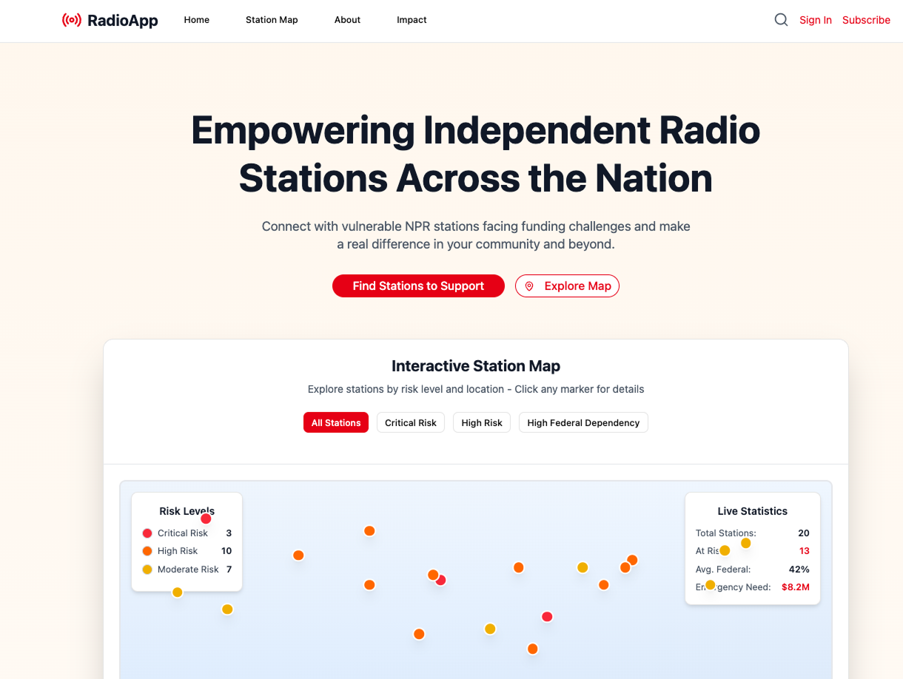

<<<<<<< HEAD
# indyradio

A platform connecting donors with publicly funded radio stations in need.

## Design

View the full design in [Figma](https://sweat-rinse-25569166.figma.site/)

## Features

- Browse radio stations
- View station needs and requirements
- Connect donors with stations
- Track donation status
- Search and filter stations
- User profiles for donors and stations

## Screenshots



## Installation

1. Clone the repository:
```bash
git clone https://github.com/cwiza/indyradio.git
```

2. Install dependencies:
```bash
npm install
```

3. Start the development server:
```bash
npm start
```

The app will be available at `http://localhost:3000`

## Usage

1. Register as a donor or station
2. Browse available stations/donors
3. Connect with stations in need
4. Track your donations and connections

## Project Structure

- `/components` - Reusable React components
- `/imports` - Project imports and configurations
- `/lib` - Utility functions and libraries
- `/styles` - Global styles and theme
- `/docs` - Documentation and screenshots
- `App.tsx` - Main application component

## Contributing

1. Fork the repository
2. Create your feature branch (`git checkout -b feature/AmazingFeature`)
3. Commit your changes (`git commit -m 'Add some AmazingFeature'`)
4. Push to the branch (`git push origin feature/AmazingFeature`)
5. Open a Pull Request

## License

This project is licensed under the MIT License - see the [LICENSE](LICENSE) file for details

## Contact

- Email: [chip@indyradio.com](mailto:chip@indyradio.com)
- Website: [indyradio.com](https://indyradio.com)

## Acknowledgments

- Built with React and TypeScript
- Design by [Chip Baker](https://github.com/cwiza)

## Getting Started

1. Clone the repository
2. Install dependencies: `npm install`
3. Start the development server: `npm start`

## Tech Stack

- React
- TypeScript
- [Other dependencies as listed in package.json]
=======
# indyradio
supporting publicly funded radio stations by matching stations in need with donors
>>>>>>> e9d3d5386d7ba4c37645f87051c8c6be8b2b1621
